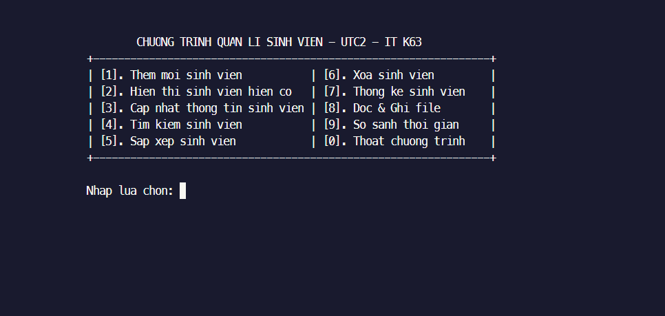

## CHƯƠNG TRÌNH QUẢN LÝ SINH VIÊN (ÁP DỤNG CTDL & GT)
    1. Kiến thức cấu trúc dữ liệu
        - Vector/Set/Map,..
        - Linked List (Doubly/Single linked list)
        - Stack/Queue/Heap/Tree/HashTable,...

    2. Kiến thức thuật toán
        - Tìm kiếm
            - Tuyến tính (Linear Search)
            - Nhị phân (Binary Search)

        - Sắp xếp
            - Sắp xếp chọn (Selection Sort)
            - Sắp xếp nổi bọt (Bubble Sort)
            - Sắp xếp chèn (Insertion sort)
            - Sắp xếp nhanh (Quick Sort)
            - Sắp xếp trộn (Merge Sort)
            - Heap sort

## CÁC CHỨC NĂNG CHÍNH CHƯƠNG TRÌNH
    
    1. Thêm sinh viên 
        - Thêm 1 sinh viên
        - Thêm nhiều sinh viên
        

    2. Hiển thị sinh viên
        - Hiển thị thông tin sinh viên
        - Hiển thị thông tin danh sách sinh viên

    3. Cập nhật sinh viên
        - Cập nhật bằng ID (Cập nhật tất cả các trường dữ liệu sẵn có)
        - Cập nhật bằng MSSV (Cập nhật tất cả các trường dữ liệu sẵn có)

    4. Tìm kiếm sinh viên
        - Tìm kiếm bằng ID
        - Tìm kiếm bằng tên

    5. Sắp xếp sinh viên
        - Tăng dần / Giảm dần (ID, Tên, Điểm trung bình)

    6. Xóa sinh viên
        - Xóa bằng ID (Có thể xóa một loạt các ID mà user liệt kê)
        - Xóa bằng tên

    7. Thống kê sinh viên
        - Thống kê theo ĐTB 
        - Thống kê theo Ngành 
        - Thống kê theo Giới tính 
        - Thống kê tổng số lượng sinh viên

    8. Đọc ghi file
        - Đọc file
        - Ghi file

    9. So sánh thời gian chạy của các thuật toán áp dụng trong bài tập
        - SelectionSort - O(n^2)
          QuickSort - O(n*log(n)) cho trường hợp trung bình.
        - MergeSort - O(n*log(n)) cho trường hợp trung bình
          QuickSort - O(n*log(n)) cho trường hợp trung bình.
        - Linear Search - O(n) cho trường hợp trung bình
          Binary Search - O(log(n)) cho trường hợp trung bình, yêu cầu DL được sắp xếp.

## TÁC GIẢ
    1. Hà Văn Dũng
    2. Nguyễn Nguyên Huy