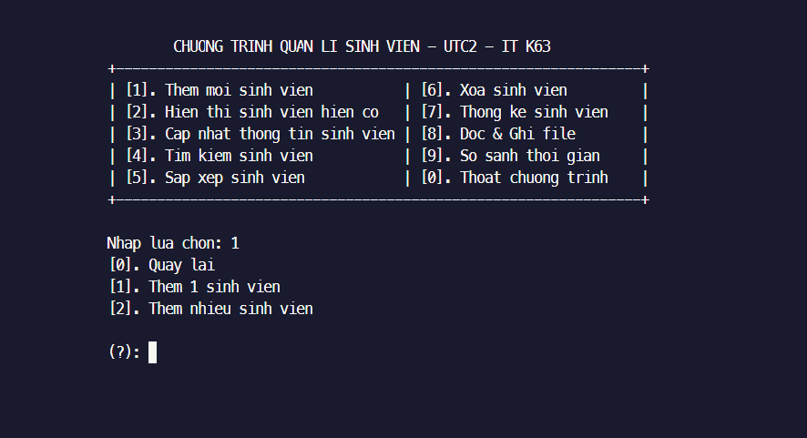
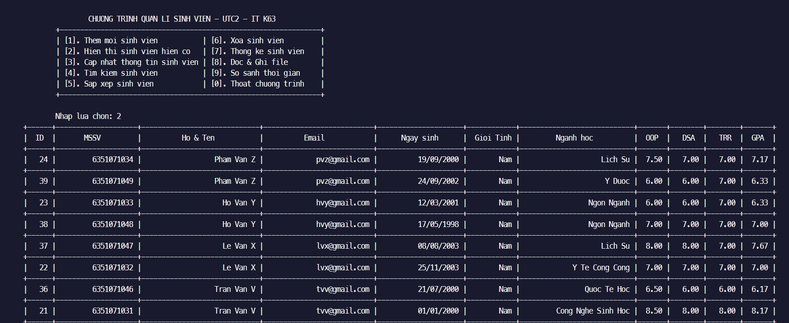
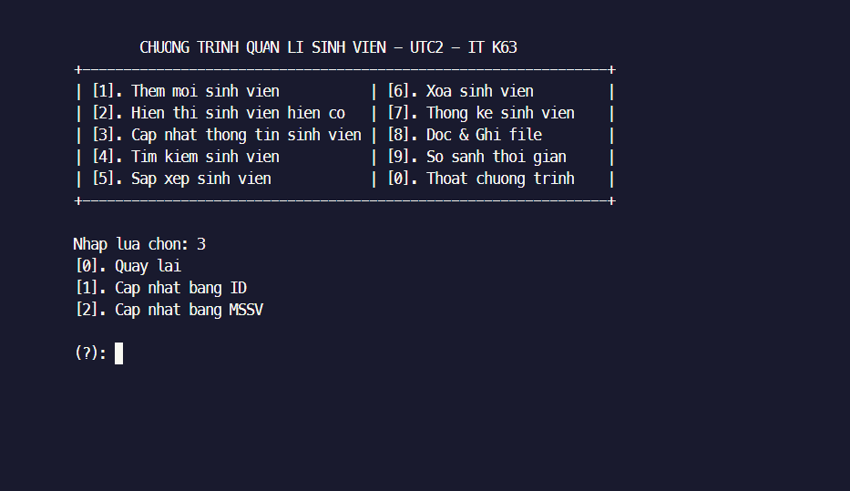
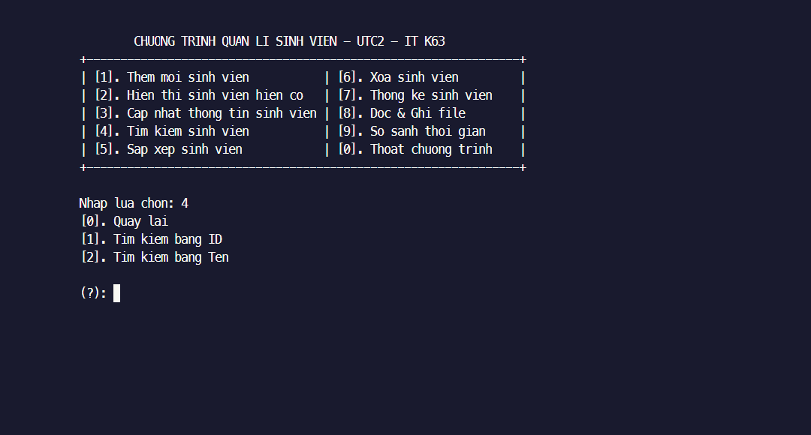
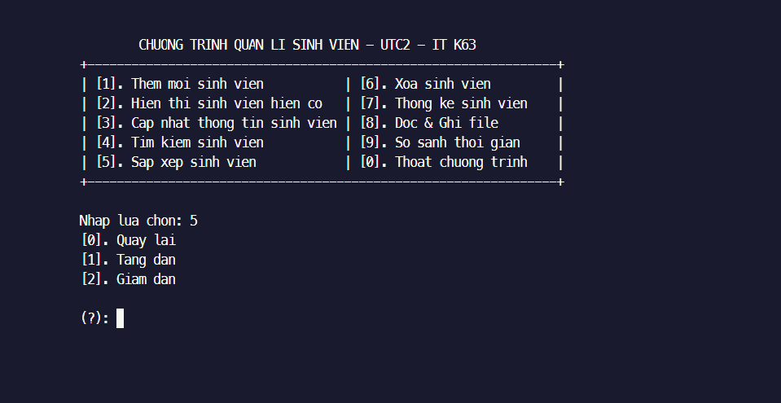
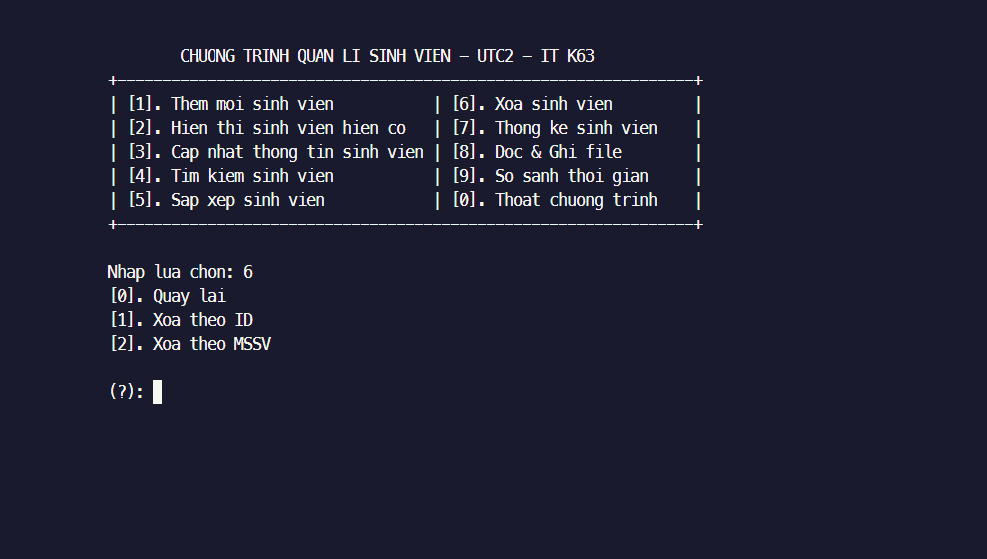
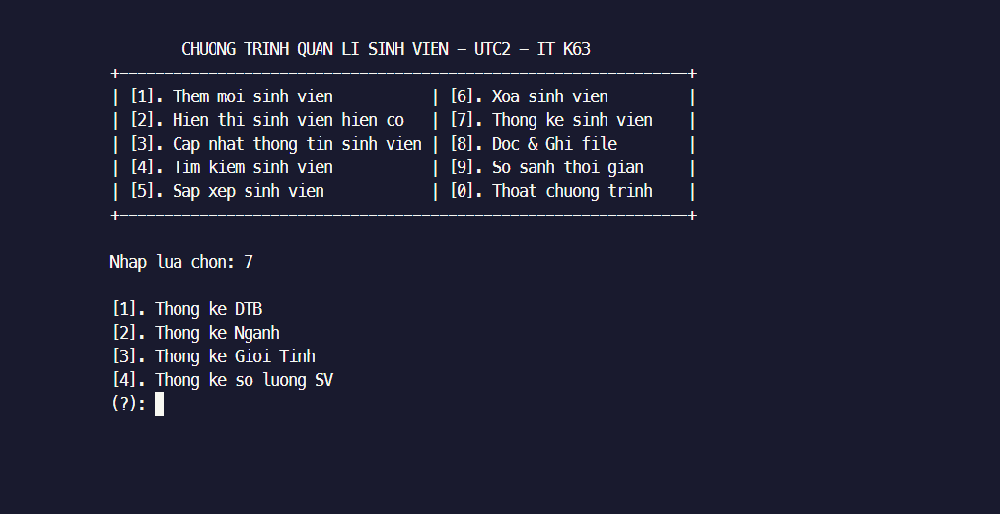
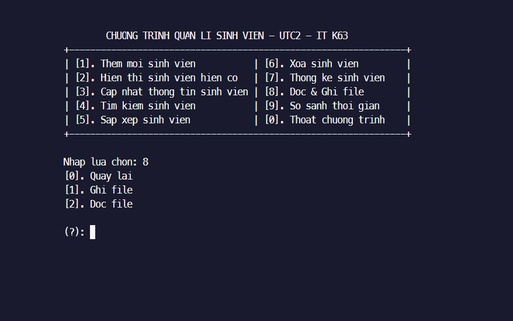
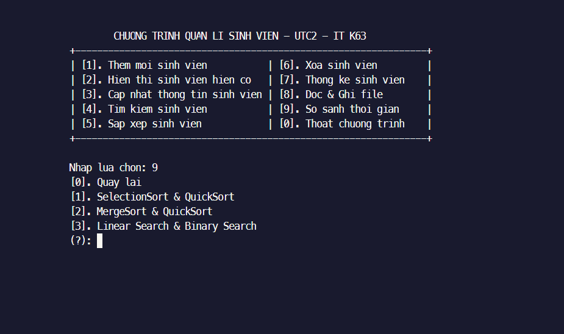

## CHƯƠNG TRÌNH QUẢN LÝ SINH VIÊN (ÁP DỤNG CTDL & GT)
----------------------------------------------------------
####1. Kiến thức cấu trúc dữ liệu
- Vector/Set/Map,..
- Linked List (Doubly/Single linked list)
- Stack/Queue/Heap/Tree/HashTable,...

####2. Kiến thức thuật toán
- **Tìm kiếm**
    - Tuyến tính (Linear Search)
    - Nhị phân (Binary Search)

- **Sắp xếp**
    - Sắp xếp chọn (Selection Sort)
    - Sắp xếp nổi bọt (Bubble Sort)
    - Sắp xếp chèn (Insertion sort)
    - Sắp xếp nhanh (Quick Sort)
    - Sắp xếp trộn (Merge Sort)
    - Heap sort
----------------------------------------------------------
## CHỨC NĂNG CHÍNH CHƯƠNG TRÌNH
###0. Menu chương trình

###1. Thêm sinh viên 

###2. Hiển thị sinh viên

###3. Cập nhật sinh viên

###4. Tìm kiếm sinh viên

###5. Sắp xếp sinh viên

###6. Xóa sinh viên

###7. Thống kê sinh viên

###8. Đọc ghi file

###9. So sánh thời gian chạy

----------------------------------------------------------

## TÁC GIẢ
    1. Hà Văn Dũng
    2. Nguyễn Nguyên Huy